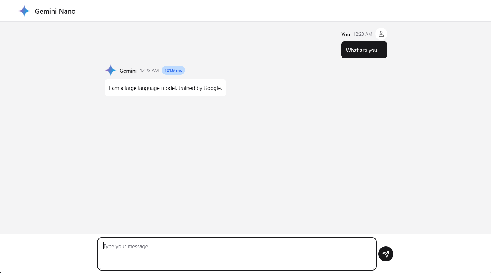

<p align="center">
    <a href="#">
    
    </a>

</p>

<h3 align="center">Simple example of using chrome on device ai with vanilla js and vite</h3>


> [!IMPORTANT]
> Check [enable AI in Chrome](#enable-ai-in-chrome)

## Running locally

Clone the repository:

```bash
git clone https://github.com/dead8309/chrome-ai-js.git
cd chrome-ai-js
```

Run

```bash
pnpm dev
```


## Enable AI in Chrome

Chrome built-in AI is a preview feature, you need to use chrome version 127 or greater, now in [dev](https://www.google.com/chrome/dev/?extra=devchannel) or [canary](https://www.google.com/chrome/canary/) channel, [may release on stable chanel at Jul 17, 2024](https://chromestatus.com/roadmap).

After then, you should turn on these flags:

- [chrome://flags/#prompt-api-for-gemini-nano](chrome://flags/#prompt-api-for-gemini-nano): `Enabled`
- [chrome://flags/#optimization-guide-on-device-model](chrome://flags/#optimization-guide-on-device-model): `Enabled BypassPrefRequirement`
- [chrome://components/](chrome://components/): Click `Optimization Guide On Device Model` to download the model.


